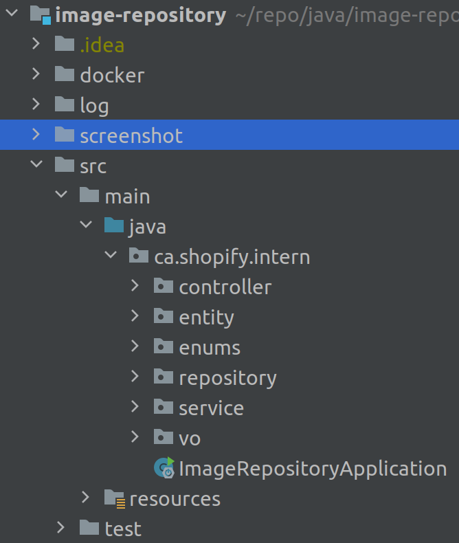

# image-repository


For the Image Repository, I was mainly focused on Search component, which is implement by elasticsearch(7.9.1).
Besides, the project based on spring boot 2.2.0 with java 13. Using the Docker to simply the development and deployment workflows.

## System dependencies
- Docker [how to install docker](https://docs.docker.com/engine/installation/)
- Docker Compose

## Building
- To build jar file, run
```
./build.sh
```
- To build docker component, run
```
docker-compose build
```

## Running
- Run:
```
docker-compose up
```

## Source Code


- controller (based on spring MVC) 
- repository (CRUD operation of elasticsearch)
- service (core business logic)
- entity (data model)
- vo (view model)